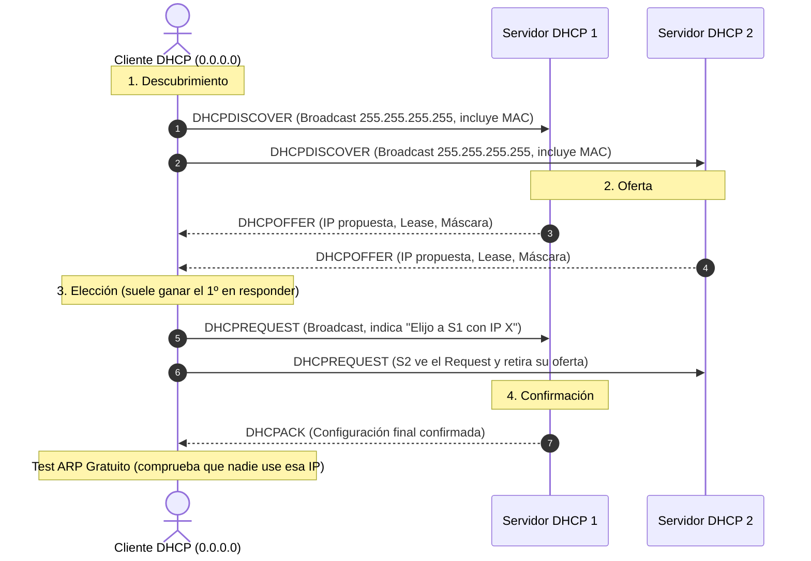

# 📘 Manual de Estudio: Protocolo DHCP (*Dynamic Host Configuration Protocol*)

---

## 1. ¿Qué es DHCP y cuál es su propósito?

**DHCP** es un protocolo cliente-servidor de capa de aplicación (puertos UDP 67 servidor / 68 cliente) diseñado para **automatizar y centralizar** la asignación de configuraciones TCP/IP en una red.

> 💡 **Analogía del Hotel:**
> Configurar una red manualmente es como si el dueño de un edificio asignara habitaciones fijas de por vida a cada persona: un caos logístico si entran y salen visitas.  
> **DHCP actúa como la recepción del hotel:** llegas sin habitación (*sin IP*), pides una llave en recepción (*DHCPDISCOVER*), te asignan una habitación temporal con un contrato de alquiler (*Lease*), y cuando te vas, devuelves la llave (*DHCPRELEASE*) para que otro huésped pueda utilizarla.

---

## 2. Parámetros que Configura DHCP

| Tipo | Parámetros | Propósito |
| :--- | :--- | :--- |
| **Básicos / Obligatorios** | • **Dirección IP del cliente**<br>• **Máscara de subred** (*subnet-mask*)<br>• **Tiempos de concesión** (*lease, renewal, rebinding*) | Permite comunicarse dentro de la propia red local y define la vigencia del "alquiler". |
| **Opcionales** | • **Puerta de enlace** (*Gateway / option routers*)<br>• **Servidores DNS** (*option domain-name-servers*)<br>• **Sufijo / Nombre de dominio DNS** (*option domain-name*) | Permite salir a otras redes/Internet y resolver nombres de dominio. |

---

## 3. Modos de Asignación de Direcciones IP

| Modo | ¿Cómo funciona? | Caso de uso ideal |
| :--- | :--- | :--- |
| **Manual / Estática (Reserva)** | Se vincula una **IP fija a una dirección MAC** específica en el servidor. | Servidores, impresoras de red, switches o para restringir acceso por MAC. |
| **Automática** | El servidor asigna una IP la primera vez y **queda asociada indefinidamente** hasta que el cliente la libere manualmente. | Redes cerradas donde el número de clientes casi no varía. |
| **Dinámica** | Se asigna una IP de un rango (*pool*) por un **tiempo limitado (*lease time*)**. Al caducar o apagarse, la IP se recicla. | Oficinas, WiFi para invitados, redes domésticas (*máxima rotación*). |
| **Híbrida** | Combinación: IPs fijas por reserva para infraestructura y rango dinámico para equipos de usuario. | Escenario empresarial real estándar. |

### Ventajas de la asignación automática/dinámica vs. manual:
* **Cero intervención manual:** los valores se cargan en el arranque del cliente.
* **Sin conflictos:** previene duplicidades de IP y errores tipográficos de máscara/DNS.
* **Facilita la movilidad:** un portátil cambia de subred/VLAN sin reconfiguración manual.

---

## 4. El Proceso DORA (Ciclo de Vida de la Concesión)

Cuando un cliente arranca sin IP, se produce la conversación de 4 pasos conocida como **DORA**:



1. **`DHCPDISCOVER` (Cliente $\to$ Broadcast `255.255.255.255`):**  
   * *"¿Hay algún servidor DHCP en la sala? Mi MAC es tal y necesito una IP."*
2. **`DHCPOFFER` (Servidor(es) $\to$ Cliente):**  
   * *"Tengo libre la `192.168.1.50` durante 24 horas. ¿Te sirve?"* (Pueden responder varios servidores).
3. **`DHCPREQUEST` (Cliente $\to$ Broadcast):**  
   * *"Acepto la oferta del Servidor 1 por la IP `192.168.1.50`."*  
   * *(Se envía por Broadcast para que los demás servidores se enteren de que no fueron elegidos y liberen sus ofertas reservadas).*
4. **`DHCPACK` (Servidor elegido $\to$ Cliente):**  
   * *"Trato cerrado. Aquí tienes tu IP, máscara, gateway y DNS."*
5. **Verificación ARP (Seguridad del cliente):**  
   * Inmediatamente después del `DHCPACK`, el cliente lanza una **petición ARP** por esa IP. Si alguien contesta, detecta un conflicto y rechaza la IP enviando un `DHCPDECLINE`.

---

## 5. Tabla Maestra de Mensajes DHCP

Hay **8 tipos de mensajes** que debes dominar:

| Mensaje | Origen | Propósito clave |
| :--- | :---: | :--- |
| **`DHCPDISCOVER`** | Cliente | Broadcast inicial para localizar servidores disponibles. |
| **`DHCPOFFER`** | Servidor | Respuesta con propuesta de IP y parámetros de concesión. |
| **`DHCPREQUEST`** | Cliente | Solicita la IP ofrecida o pide la renovación de su contrato actual. |
| **`DHCPACK`** | Servidor | Confirmación con los parámetros definitivos de red. |
| **`DHCPNAK` / `DHCPNACK`** | Servidor | Rechazo (*Negative Acknowledge*): la IP pedida no es válida, expiró o no pertenece a la subred. |
| **`DHCPDECLINE`** | Cliente | Informa al servidor de que la IP ofrecida ya está en uso en la red (*detectado por ARP*). |
| **`DHCPRELEASE`** | Cliente | Libera voluntariamente la dirección IP antes de que expire el tiempo (*ej. al apagar o desconectar*). |
| **`DHCPINFORM`** | Cliente | El cliente ya tiene IP estática y **solo pide parámetros adicionales** (*ej. rutas, DNS o WINS*). |

---

## 6. Tiempos de Concesión (*Leases*) y Renovación

El "contrato" de una IP no es eterno; se rige por tres tiempos:
1. **$T_1$ - Renewal Time (50% del Lease):**  
   El cliente envía un `DHCPREQUEST` **Unicast** directamente al servidor original para pedir una prórroga. Si el servidor contesta `DHCPACK`, el contador se reinicia.
2. **$T_2$ - Rebinding Time (87.5% del Lease):**  
   Si el servidor original no responde (*ej. servidor caído*), el cliente entra en pánico y envía un `DHCPREQUEST` por **Broadcast** a *cualquier* servidor DHCP de la red para que le renueve la concesión.
3. **Expiración total (100%):**  
   Si nadie responde antes del 100% del tiempo, el cliente **debe dejar de usar la IP de inmediato** y volver al estado inicial emitiendo un nuevo `DHCPDISCOVER`.

---

## 7. Configuración de Servidor DHCP (`dhcpd.conf` en Linux/ISC)

### 7.1. Parámetros Globales Clave
* **`authoritative;`**:  
  > ⚠️ **Muy importante:** Declara que este servidor es la **autoridad oficial** del segmento de red. Si un cliente pide una IP incorrecta (de otra red o subred antigua), el servidor le envía un `DHCPNAK` inmediato para forzarlo a pedir una IP válida. Evita problemas si un usuario conecta un router doméstico accidentalmente.
* **`lease-file-name "<ruta>";`**: Archivo de base de datos donde se persisten las concesiones activas (`/var/lib/dhcp/dhcpd.leases`).
* **`server-identifier <IP>;`**: IP de escucha e identificación del servidor si posee múltiples interfaces.
* **`default-lease-time <segundos>;`**: Tiempo base de concesión (ej. `86400` = 1 día).
* **`max-lease-time <segundos>;`**: Límite máximo de alquiler aunque un cliente solicite más tiempo.
* **`ddns-update-style none;`**: Deshabilita la actualización automática dinámica de registros en servidores DNS.

### 7.2. Opciones de Red Comunes (`options`)
* `option subnet-mask 255.255.255.0;`
* `option broadcast-address 192.168.1.255;`
* `option routers 192.168.1.1;` *(Puerta de enlace)*
* `option domain-name-servers 8.8.8.8, 1.1.1.1;` *(DNS)*
* `option domain-name "empresa.local";` *(Sufijo de búsqueda)*

---

### 7.3. Plantilla de Ejemplo Completo (`dhcpd.conf`)

```nginx
# 1. Directivas globales
authoritative;
default-lease-time 43200;      # 12 horas
max-lease-time 86400;          # 24 horas
ddns-update-style none;

# 2. Declaración de Subred y Pool Dinámico
subnet 192.168.10.0 netmask 255.255.255.0 {
    range 192.168.10.100 192.168.10.200;      # Rango para asignación dinámica
    option routers 192.168.10.1;              # Gateway
    option domain-name-servers 192.168.10.10, 8.8.8.8;
    option domain-name "tic.local";
    option broadcast-address 192.168.10.255;
}

# 3. Asignación Manual / Reserva Estática por MAC
host impresora-planta1 {
    hardware ethernet 00:11:22:33:44:55;
    fixed-address 192.168.10.25;
    host-name "impresora-planta1";
}

# 4. Declaración por Grupo (parámetros compartidos)
group {
    option domain-name-servers 1.1.1.1;
    host pc-admin {
        hardware ethernet aa:bb:cc:dd:ee:01;
        fixed-address 192.168.10.10;
    }
}
```

---

## 🎯 Resumen para Exámenes / Preguntas Rápidas

1. **¿Por qué el cliente envía `DHCPREQUEST` en Broadcast si ya recibió la oferta?**  
   Para que todos los servidores DHCP que hicieron ofertas sepan cuál fue aceptada y puedan liberar inmediatamente las IP que habían reservado.
2. **¿Qué herramienta usa el cliente para verificar que no haya colisión tras el `DHCPACK`?**  
   Una consulta **ARP gratuito**. Si responde alguien, manda un **`DHCPDECLINE`**.
3. **¿Para qué sirve `authoritative`?**  
   Para rechazar con `DHCPNAK` configuraciones obsoletas o erróneas de clientes y forzarlos a renovar correctamente.
4. **¿Cuál es la diferencia entre asignación automática y dinámica?**  
   La **automática** es permanente (sin caducidad hasta que el cliente la libere explícitamente); la **dinámica** tiene tiempo de caducidad (*lease time*) y reutiliza direcciones libres.
