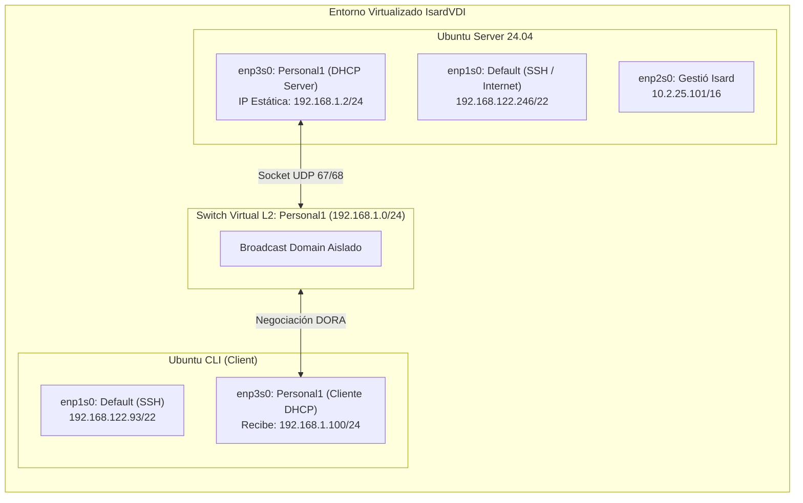

# Laboratorio DHCP: Despliegue de `isc-dhcp-server` en Entorno Aislado

[](https://ubuntu.com/)
[](https://www.isc.org/dhcp/)
[]()
[](https://agora.xtec.cat/itb/)

---

## 🎯 1. ¿Qué estamos haciendo?

Implementar y validar un **servidor DHCP autoritativo** en Linux (**Ubuntu Server 24.04**) utilizando el paquete estándar de la industria `isc-dhcp-server`.  
El laboratorio provee direccionamiento dinámico automático, opciones de red (Default Gateway, DNS corporativos, sufijo de dominio) y reservas estáticas vinculadas a direcciones físicas (MAC) para clientes Linux en línea de comandos (CLI).

---

## 💡 2. ¿Por qué lo hacemos?

1. **Automatización de direccionamiento IP:** Configurar direccionamiento estático host por host en una infraestructura empresarial es inviable y propenso a errores humanos o colisiones de IP.
2. **Aislamiento estricto de Capa 2 (Seguridad):** En un entorno compartido como el aula del instituto, encender un servidor DHCP en una red física (*bridged*) provocaría un incidente de **Rogue DHCP**, interceptando peticiones y dejando sin salida a Internet a los compañeros. Por eso, el laboratorio se aísla en el switch virtual `Personal1` de IsardVDI.
3. **Servidor Autoritativo (`authoritative`):** Evita la coexistencia de configuraciones erróneas. Si un cliente solicita una IP obsoleta o ajena al segmento, el servidor responde con un `DHCPNAK` forzando una renovación limpia desde cero.
4. **Políticas de control y seguridad L7:** Mitigar riesgos comunes como ataques por agotamiento de pool (`deny declines`) y descartar protocolos antiguos sin temporizadores (`deny bootp`).

---

## 🛠️ 3. ¿Cómo lo hemos hecho?

### Topología y Arquitectura de Red

El escenario se monta en **IsardVDI** (KVM/QEMU) con dos máquinas virtuales interconectadas por un switch virtual privado:



### Matriz de Direccionamiento
| Elemento | Interfaz | IP / Rango | Función |
| :--- | :--- | :--- | :--- |
| **Ubuntu Server** | `enp3s0` | `192.168.1.2/24` | IP fija del servidor (Netplan) |
| **Virtual Gateway** | - | `192.168.1.1` | Puerta de enlace enviada vía Option 3 |
| **Pool Dinámico** | `Personal1` | `192.168.1.100 - .200` | Rango para clientes genéricos |
| **Reserva 'Isabel'** | MAC `00:00:45:12:EE:F4` | `192.168.1.21` | Reserva con lease permanente (`-1`) |
| **Reserva 'Fernando'**| MAC `00:00:45:13:1E:44` | `192.168.1.22` | Reserva con DNS propio (`192.168.1.20`) |

---

### Configuración Aplicada

#### 1. IP Estática del Servidor ([`configs/iface-enp3s0.yaml`](configs/iface-enp3s0.yaml))
El servidor nunca puede depender de DHCP en su tarjeta de servicio:
```yaml
network:
  version: 2
  renderer: networkd
  ethernets:
    enp3s0:
      dhcp4: no
      addresses:
        - 192.168.1.2/24
```

#### 2. Amarre de Interfaces ([`configs/isc-dhcp-server`](configs/isc-dhcp-server))
Asegura que el demonio solo procese tráfico en la red privada `Personal1`:
```bash
INTERFACESv4="enp3s0"
INTERFACESv6=""
```

#### 3. Reglas y Reservas ([`configs/dhcpd.conf`](configs/dhcpd.conf))
```text
# Parámetros Globales
authoritative;
one-lease-per-client on;
default-lease-time 600;
max-lease-time 7200;
option domain-name "aula53.asir";
option domain-name-servers 192.168.1.10, 192.168.1.11;

# Endurecimiento
ddns-update-style none;
deny declines;
deny bootp;

# Subred y Pool Dinámico
subnet 192.168.1.0 netmask 255.255.255.0 {
    range 192.168.1.100 192.168.1.200;
    option broadcast-address 192.168.1.255;
    option routers 192.168.1.1;
    option subnet-mask 255.255.255.0;
}

# Reservas por MAC
host Isabel {
    hardware ethernet 00:00:45:12:EE:F4;
    fixed-address 192.168.1.21;
    default-lease-time -1;
    max-lease-time -1;
    option host-name "Isabel";
}

host Fernando {
    hardware ethernet 00:00:45:13:1E:44;
    fixed-address 192.168.1.22;
    option domain-name-servers 192.168.1.20;
}
```

---

## 📊 4. Resultados y Verificación Técnica

### Evidencia 1: Demonio Activo y Socket a la Escucha
Verificación en el servidor de que `dhcpd` está corriendo y escuchando en el puerto UDP 67 sobre `enp3s0`:


* Proceso `dhcpd[798]` en estado `active (running)`.
* Socket abierto en `LPF/enp3s0/52:54:00:19:98:53/192.168.1.0/24`.

---

### Evidencia 2: Negociación del Ciclo DORA en el Cliente
En la máquina cliente, solicitando IP mediante `sudo dhclient -r enp3s0 && sudo dhclient -v enp3s0`:


1. **`DHCPDISCOVER`:** El cliente envía difusión buscando servidor en el puerto 67.
2. **`DHCPOFFER`:** El servidor `192.168.1.2` ofrece la dirección libre `192.168.1.100`.
3. **`DHCPREQUEST`:** El cliente solicita formalmente la IP ofrecida.
4. **`DHCPACK`:** El servidor valida la concesión (`bound to 192.168.1.100`, renovación programada a los 251s).

---

### Evidencia 3: Validación de Parámetros en el Sistema Cliente
Comprobando que el stack de red del cliente aplicó correctamente la IP, Gateway y DNS:


* **Direccionamiento:** `enp3s0` con `192.168.1.100/24`.
* **Tabla de rutas:** Ruta por defecto aplicada (`default via 192.168.1.1 dev enp3s0`).
* **Resolución DNS (`resolvectl`):** Servidores `192.168.1.10` y `192.168.1.11` bajo el dominio `aula53.asir`.

---

### Evidencia 4: Registro Transaccional en Base de Datos de Leases
Inspección de `/var/lib/dhcp/dhcpd.leases` en el servidor:


* El contrato queda persistido en disco con la MAC física del cliente (`52:54:00:3c:b2:e1`), estado `binding state active` y hostname `isardvdi`.

---

## 🔧 5. Troubleshooting Real

1. **Interfaz del cliente en estado `DOWN`:**  
   Al arrancar la máquina cliente, la tarjeta de prácticas no tenía enlace administrativo. Se levantó con `sudo ip link set enp3s0 up` antes de solicitar IP.
2. **Ausencia de cliente DHCP tradicional:**  
   En Ubuntu Server actual no se incluye `dhclient` de serie. Se instaló `isc-dhcp-client` para auditar la traza DORA explícita con el flag `-v`.
3. **Corrección de sintaxis en reservas:**  
   La directiva oficial en ISC-DHCP es obligatoriamente `hardware ethernet` en inglés (la traducción no es válida para el parser de `dhcpd`).

---

## 📂 Archivos del Laboratorio

```text
├── README.md                           # Informe técnico completo del laboratorio
├── configs/
│   ├── iface-enp3s0.yaml               # Configuración Netplan del servidor
│   ├── isc-dhcp-server                 # Interfaz de escucha del demonio
│   └── dhcpd.conf                      # Reglas, pool dinámico y reservas
└── img/
    ├── 01_server_service_status.png    # Evidencia: Socket y proceso
    ├── 02_client_dora_negotiation.png  # Evidencia: Ciclo DORA
    ├── 03_client_network_verification.png # Evidencia: IP, ruta y DNS
    └── 04_server_lease_database.png    # Evidencia: Registro de concesiones
```

---
*Laboratorio documentado por **Bo Hao Zhang** — 2º ASIX, Institut TIC de Barcelona.*
