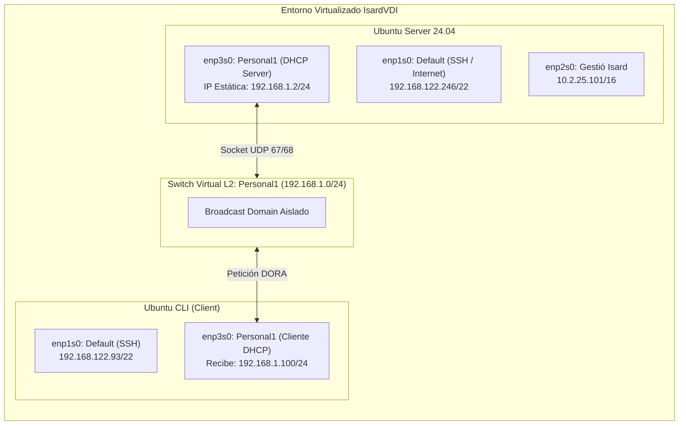
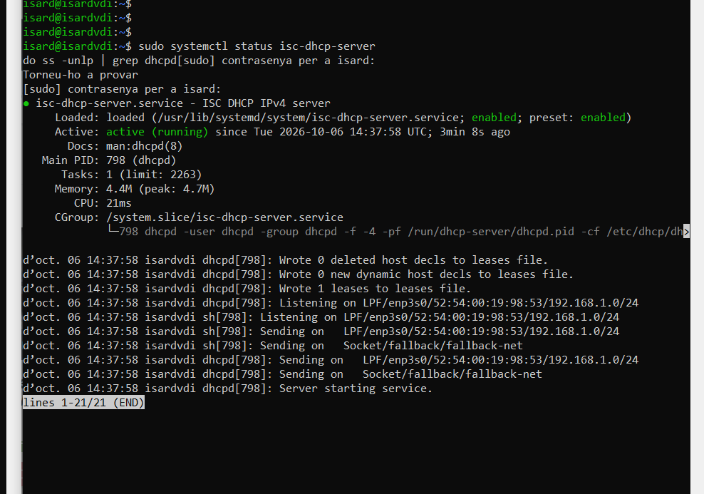
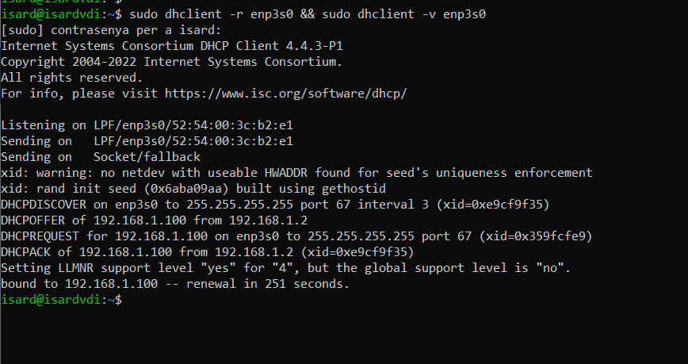
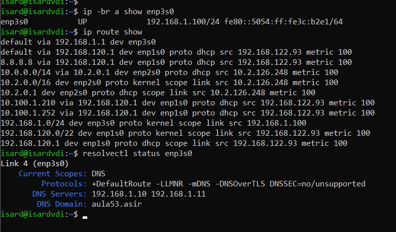
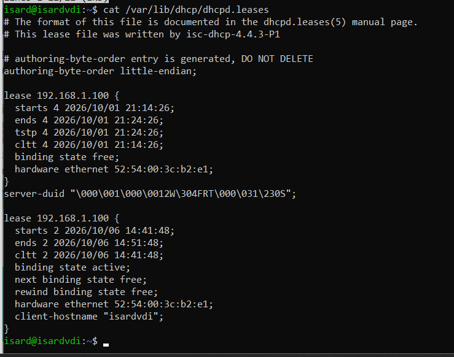

# Laboratorio DHCP: Despliegue de `isc-dhcp-server` en Entorno Aislado

[](https://ubuntu.com/)
[](https://www.isc.org/dhcp/)
[]()
[](https://agora.xtec.cat/itb/)

> 📌 **Contexto del Proyecto:**  
> Este repositorio documenta la **Pràctica 1 (Serveis DHCP)** del módulo **M06 (Sistemes Operatius en Xarxa)** en el **Institut TIC de Barcelona** (2º curso de ASIX).  
> El objetivo es desplegar y verificar un servidor DHCP autoritativo en Linux (`isc-dhcp-server`) dentro de una red virtual privada y aislada (`Personal1`), evitando cualquier fuga de paquetes o conflicto en la red física del centro educativo, implementando pools dinámicos, reservas estáticas por MAC y verificando el ciclo DORA completo en clientes por línea de comandos (CLI).

---

## 🗺️ Topología de Red y Arquitectura

El laboratorio se ha implementado sobre la plataforma de virtualización **IsardVDI** (KVM/QEMU) con dos máquinas virtuales interconectadas:



### Tabla de Direccionamiento
| Elemento | Interfaz | IP / Rango | Propósito |
| :--- | :--- | :--- | :--- |
| **Ubuntu Server** | `enp3s0` | `192.168.1.2/24` | IP estática fija del servidor DHCP |
| **Virtual Gateway** | - | `192.168.1.1` | Puerta de enlace entregada vía Option 3 |
| **Pool Dinámico** | `Personal1` | `192.168.1.100 - .200` | Rango de concesión para clientes generales |
| **Reserva 'Isabel'** | MAC `00:00:45:12:EE:F4` | `192.168.1.21` | Reserva con lease permanente (`-1`) |
| **Reserva 'Fernando'**| MAC `00:00:45:13:1E:44` | `192.168.1.22` | Reserva con DNS específico (`192.168.1.20`) |

---

## ⚙️ Implementación y Ficheros de Configuración

### 1. IP Estática con Netplan en el Servidor
Para que el servidor pueda repartir direcciones en la red privada, su propia IP debe ser inmutable. En [`configs/iface-enp3s0.yaml`](configs/iface-enp3s0.yaml):

```yaml
network:
  version: 2
  renderer: networkd
  ethernets:
    enp3s0:
      dhcp4: no
      addresses:
        - 192.168.1.2/24
```
*Se aplica con `sudo netplan apply` comprobando con `ip -br a`.*

### 2. Amarre de Interfaces en el Demonio
Para evitar escuchar peticiones en la red de gestión o en la de salida a Internet, en [`configs/isc-dhcp-server`](configs/isc-dhcp-server) se limita la escucha a `enp3s0`:

```bash
INTERFACESv4="enp3s0"
INTERFACESv6=""
```

### 3. Fichero Principal de Reglas (`/etc/dhcp/dhcpd.conf`)
Fichero central [`configs/dhcpd.conf`](configs/dhcpd.conf) con opciones globales, seguridad, pool dinámico y reservas:

```text
# Parámetros globales y autoridad
authoritative;
one-lease-per-client on;
default-lease-time 600;
max-lease-time 7200;
option domain-name "aula53.asir";
option domain-name-servers 192.168.1.10, 192.168.1.11;

# Endurecimiento
ddns-update-style none;
deny declines;
deny bootp;

# Subred y Rango
subnet 192.168.1.0 netmask 255.255.255.0 {
    range 192.168.1.100 192.168.1.200;
    option broadcast-address 192.168.1.255;
    option routers 192.168.1.1;
    option subnet-mask 255.255.255.0;
}

# Reservas de Hosts
host Isabel {
    hardware ethernet 00:00:45:12:EE:F4;
    fixed-address 192.168.1.21;
    default-lease-time -1;
    max-lease-time -1;
    option host-name "Isabel";
}

host Fernando {
    hardware ethernet 00:00:45:13:1E:44;
    fixed-address 192.168.1.22;
    option domain-name-servers 192.168.1.20;
}
```

---

## 📸 Evidencias Técnicas y Validación en Vivo

### 1. Comprobación del Servicio y Enlace de Socket en el Servidor
Verificación con `systemctl status` demostrando que el proceso está activo y enlazado al socket de red en `enp3s0`:



> **Lectura técnica:** El proceso `dhcpd[798]` inicializa el servicio, carga la base de datos de leases y se pone a la escucha en `LPF/enp3s0/52:54:00:19:98:53/192.168.1.0/24`.

---

### 2. Trazabilidad del Ciclo DORA en el Cliente CLI
Ejecutando `sudo dhclient -r enp3s0 && sudo dhclient -v enp3s0` en la máquina cliente:



> **Lectura técnica:**
> 1. `DHCPDISCOVER`: El cliente difunde por broadcast al puerto 67 pidiendo configuración.
> 2. `DHCPOFFER`: El servidor `192.168.1.2` ofrece la IP disponible `192.168.1.100`.
> 3. `DHCPREQUEST`: El cliente confirma y formaliza la petición para `192.168.1.100`.
> 4. `DHCPACK`: El servidor sella la concesión con un tiempo de renovación de 251 segundos (la mitad del lease efectivo negociado).

---

### 3. Verificación de Parámetros Recibidos en el Cliente
Comprobando que el cliente no solo recibió IP, sino Gateway y servidores DNS corporativos:



> **Lectura técnica:**
> * `ip -br a`: Interfaz `enp3s0` en estado UP con la IP `192.168.1.100/24`.
> * `ip route`: Puerta de enlace por defecto agregada: `default via 192.168.1.1 dev enp3s0`.
> * `resolvectl`: Servidores DNS configurados (`192.168.1.10`, `192.168.1.11`) bajo el sufijo de dominio `aula53.asir`.

---

### 4. Base de Datos de Concesiones en el Servidor
Lectura del archivo `/var/lib/dhcp/dhcpd.leases` en el servidor:



> **Lectura técnica:** Se comprueba el registro transaccional con la entrada `lease 192.168.1.100`, estado `binding state active`, vinculando la MAC `52:54:00:3c:b2:e1` y el hostname `isardvdi`.

---

## 🛠️ Notas de Laboratorio y Troubleshooting Real

Durante el laboratorio surgieron varios detalles prácticos reales propios del entorno de pruebas:

1. **Interfaz en estado `DOWN` en el cliente:**  
   Al arrancar la máquina cliente, la tarjeta de prácticas aparecía administrativamente apagada (`enp3s0 DOWN`). Hubo que activarla manualmente con `sudo ip link set enp3s0 up` antes de poder solicitar IP.
2. **Ausencia de `dhclient` en Ubuntu reciente:**  
   Las plantillas modernas de Ubuntu Server ya no incluyen `dhclient` por defecto (usan `systemd-networkd` o Netplan). Para forzar y visualizar el proceso detallado DORA en consola, se instaló el cliente con `sudo apt install isc-dhcp-client -y`.
3. **Sintaxis de reservas:**  
   En la guía del ejercicio se mencionaba la directiva como `maquinari ethernet`; sin embargo, la sintaxis oficial de ISC-DHCP requiere obligatoriamente `hardware ethernet` en inglés, de lo contrario `dhcpd -t` aborta el arranque por error sintáctico.

---

## 📁 Estructura del Repositorio

```text
├── README.md                           # Documentación principal del laboratorio
├── configs/
│   ├── iface-enp3s0.yaml               # Fichero Netplan del servidor
│   ├── isc-dhcp-server                 # Definición de interfaces del demonio
│   └── dhcpd.conf                      # Configuración central de ISC-DHCP
└── img/
    ├── 01_server_service_status.png    # Evidencia: Estado y socket del servidor
    ├── 02_client_dora_negotiation.png  # Evidencia: Handshake DORA en cliente
    ├── 03_client_network_verification.png # Evidencia: Verificación IP, Gateway y DNS
    └── 04_server_lease_database.png    # Evidencia: Registro activo en dhcpd.leases
```

---
*Laboratorio realizado y documentado por **Bo Hao Zhang** — Estudiante de ASIX / ASIR en el Institut TIC de Barcelona.*
