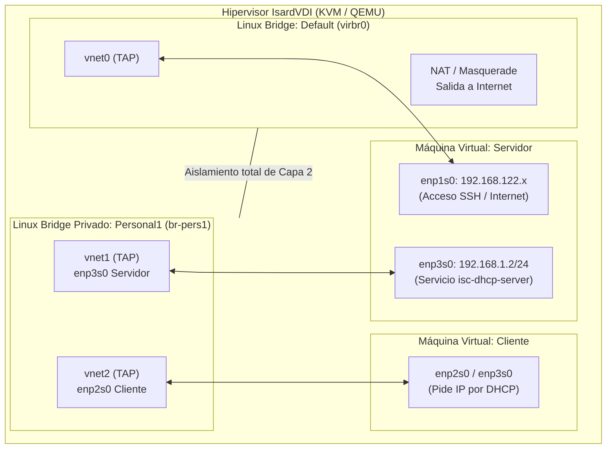
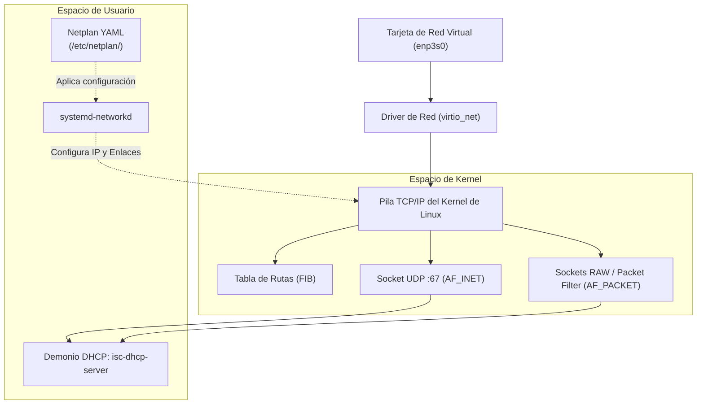
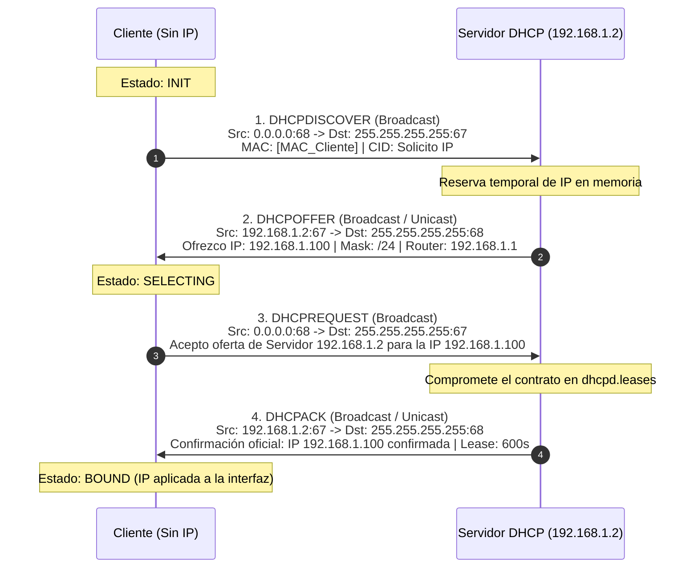

# Manual Teórico de Ingeniería de Sistemas: DHCP en Linux
**De Cimiento a Carretera: Fundamentos de Redes, Kernel y el Servicio ISC-DHCP**
*Institut TIC de Barcelona — M06 Sistemes Operatius en Xarxa (ASIX / ASIR)*

---

## 🏗️ 1. Cimientos Físicos y de Virtualización (Capa L1 / L2)

Para comprender cómo viaja un paquete DHCP, primero debemos entender la carretera física y virtual por la que circula.



### 1.1. Cómo funciona la red virtual en KVM / QEMU
En un entorno como **IsardVDI**, las máquinas virtuales no tienen tarjetas de red de plástico y cobre conectadas a un switch físico. En su lugar:
* El hipervisor crea interfaces virtuales de tipo **TAP** (`vnetX`) en el sistema anfitrión.
* Estas interfaces se conectan a **Linux Bridges** (puentes de software que operan como switches de Capa 2 / Enlace).
* Cuando tu máquina virtual envía una trama Ethernet, el driver virtualizado (`virtio_net`) la entrega directamente a la memoria del hipervisor, que la reenvía por el bridge correspondiente.

### 1.2. El Aislamiento de Red: `Default` vs `Personal1`
* **Red `Default` (`enp1s0`):** Está conectada a un bridge gestionado por el hipervisor con NAT (*Network Address Translation*). Este switch proporciona acceso a Internet y enrutamiento hacia la red del centro educativo. Por aquí entra tu sesión **SSH**.
* **Red `Personal1` (`enp3s0`):** Es un switch virtual privado e independiente que funciona como un **cable Ethernet directo y exclusivo** entre tu Servidor y tu Cliente. En esta red **no hay ningún router ni servidor DHCP previo**.

### 1.3. El peligro catastrófico del *Rogue DHCP Server*
Si por error configuraras la interfaz del servidor DHCP en modo puente (*Bridged*) conectada a la red física de la clase:
* Tu servidor empezaría a responder a los `DHCPDISCOVER` de los ordenadores reales de tus compañeros y profesores.
* Al tener configurada la IP del router como `192.168.1.1` o dominios como `aula53.asir`, desviarías el tráfico de la red física hacia una pasarela inexistente, **tumbando la conexión a Internet de toda la clase**.
* Por este motivo, el uso de redes virtuales aisladas como `Personal1` es una **medida estricta de seguridad L2**.

---

## 🐧 2. La Pila de Red en el Kernel de Linux

Cuando un paquete llega a una tarjeta de red en Linux, atraviesa una serie de subsistemas antes de que cualquier programa pueda leerlo.



### 2.1. Netplan: La Capa de Abstracción de Red
Durante años, la configuración de red en Linux estuvo fragmentada:
* Servidores clásicos: `/etc/network/interfaces` (*ifupdown*).
* Escritorios Linux: *NetworkManager*.
* Entornos cloud y contenedores: *systemd-networkd*.

**Netplan** nació en Ubuntu para solucionar este problema: no es un servicio de red en sí mismo, sino un **generador de configuración**. Lee archivos declarativos en formato **YAML** ubicados en `/etc/netplan/` y genera las configuraciones correspondientes para el motor de bajo nivel (*renderer*):
* En **Ubuntu Server**, el renderer predeterminado es **`systemd-networkd`**.
* En **Ubuntu Desktop**, el renderer predeterminado suele ser **`NetworkManager`**.

### 2.2. Por qué Netplan exige un fichero por interfaz
Las imágenes cloud de Ubuntu incluyen por defecto el archivo `/etc/netplan/50-cloud-init.yaml`, que configura las tarjetas para pedir IP automáticamente por DHCP.
Para separar responsabilidades:
1. `50-cloud-init.yaml` mantiene `enp1s0` viva para Internet y SSH.
2. `iface-enp3s0.yaml` toma el control de `enp3s0`, desactiva el cliente DHCP (`dhcp4: no`) y fija la IP estática `192.168.1.2/24`.

### 2.3. La Regla de Oro del Servidor DHCP
Un servidor DHCP **jamás puede tener una IP dinámica en la interfaz por la que ofrece servicio**.
* Si el servidor dependiera de DHCP para obtener su propia IP en `Personal1`, se produciría una paradoja circular: el servidor no puede arrancar el servicio sin tener una subred asignada en su tarjeta, y no puede obtener IP porque nadie en esa red aislada le responde.
* Por eso, la IP `192.168.1.2` se fija de forma permanente antes de arrancar el servicio.

---

## 🔄 3. El Protocolo DHCP a Bajo Nivel (Capa de Transporte y Aplicación)

DHCP está definido en la **RFC 2131**. Es un protocolo de Capa de Aplicación montado sobre la Capa de Transporte mediante **UDP**.

### 3.1. ¿Por qué UDP y no TCP?
* **TCP** requiere un saludo en tres fases (*3-Way Handshake: SYN -> SYN/ACK -> ACK*) que exige conocer de antemano la dirección IP de origen y de destino para abrir un socket de conexión.
* Un equipo recién encendido **carece de dirección IP**. No puede calcular sumas de verificación TCP sobre una IP que no posee.
* **UDP** es un protocolo sin conexión: permite disparar datagramas directamente a la red sin negociación previa.

### 3.2. Los Puertos de DHCP
* **UDP Puerto 67:** Puerto de escucha del **Servidor DHCP**.
* **UDP Puerto 68:** Puerto de escucha de los **Clientes DHCP**.

### 3.3. El Dilema del Huevo y la Gallina: ¿Cómo enviar un paquete IP sin tener IP?
Cuando el cliente se enciende, construye un paquete IP especial con los siguientes valores de cabecera:

| Parámetro | Valor de Cabecera | Significado |
| :--- | :--- | :--- |
| **IP Origen** | `0.0.0.0` | "No tengo dirección IP todavía" |
| **IP Destino** | `255.255.255.255` | Broadcast limitado (a todos los equipos del segmento L2) |
| **MAC Origen** | `52:54:00:xx:xx:xx` | La dirección física real grabada en la tarjeta del cliente |
| **MAC Destino** | `FF:FF:FF:FF:FF:FF` | Broadcast de Capa 2 (todos los puertos del switch procesan la trama) |
| **Transaction ID (xid)** | Número aleatorio de 32 bits | Identificador único de transacción para correlacionar la respuesta |

---

### 3.4. Anatomía del Ciclo DORA



1. **DHCPDISCOVER:**
   * El cliente grita a la red que busca un servidor DHCP.
   * Contiene su dirección MAC física y una lista de opciones solicitadas (*Parameter Request List*: máscara, router, DNS, nombre de dominio).
2. **DHCPOFFER:**
   * El servidor busca en su pool dinámico o en su tabla de reservas por MAC.
   * Selecciona una IP disponible (ej. `192.168.1.100`), la marca temporalmente como reservada para evitar ofrecérsela a otro equipo y responde con las opciones de red configuradas.
3. **DHCPREQUEST:**
   * Aunque ya tiene una oferta, **el cliente vuelve a enviar este paquete por broadcast**.
   * *¿Por qué por broadcast si ya sabe quién es el servidor?* Porque en una red real puede haber múltiples servidores DHCP que enviaron un `DHCPOFFER`. Al enviar el `DHCPREQUEST` en broadcast declarando `Server-ID = 192.168.1.2`, los otros servidores se enteran de que su oferta fue rechazada y devuelven sus IPs al pool libre.
4. **DHCPACK:**
   * El servidor confirma definitivamente la asignación.
   * Escribe la transacción de forma inmediata en el disco duro (`/var/lib/dhcp/dhcpd.leases`). A partir de este instante, el cliente aplica la IP a su kernel y entra en estado **BOUND**.

---

### 3.5. Mensajes de Control Adicionales
* **DHCPNAK (*Negative Acknowledgment*):** El servidor rechaza la petición del cliente. Ocurre si el cliente intenta reutilizar una IP que ya no pertenece a esa subred o si su reserva ha caducado.
* **DHCPDECLINE:** Si el cliente, antes de usar la IP, envía un paquete **Gratuitous ARP** y detecta que otro equipo ya está usando esa misma IP en la red, envía un `DHCPDECLINE` al servidor notificándole que esa dirección está en conflicto.
* **DHCPRELEASE:** El cliente notifica al servidor de forma ordenada que ya no necesita la IP (por ejemplo, al ejecutar `dhclient -r` o apagar el equipo limpiamente), liberando el contrato antes de que expire el tiempo.
* **DHCPINFORM:** El cliente ya tiene una IP fija configurada manualmente, pero contacta al servidor DHCP únicamente para solicitar parámetros auxiliares (servidores DNS, nombres de dominio o servidores NTP).

---

## ⚙️ 4. El Motor ISC-DHCP y la Anatomía de sus Ficheros

El paquete `isc-dhcp-server` ejecuta en segundo plano el demonio `dhcpd`.

### 4.1. `/etc/default/isc-dhcp-server`: Control de Interfaces
El kernel de Linux permite a los programas de red asociar sus sockets a interfaces físicas específicas mediante la opción `SO_BINDTODEVICE`.
Cuando configuras:
```bash
INTERFACESv4="enp3s0"
```
El script de arranque de `systemd` le pasa al demonio el argumento `dhcpd -user dhcpd -group dhcpd enp3s0`. De este modo:
* El servidor **ignora** cualquier broadcast que provenga de `enp1s0` (Internet / red del instituto).
* Únicamente procesa paquetes que entren por la interfaz de la red privada `Personal1`.

---

### 4.2. `/etc/dhcp/dhcpd.conf`: Desglose Directiva por Directiva

#### A. Parámetros de Autoridad y Gestión
* **`authoritative;`**  
  Por defecto, si un servidor DHCP no reconoce una petición de un cliente, la ignora por si acaso hay otro servidor en la red. Al marcar `authoritative`, declaras que tu servidor es la **única autoridad oficial de esa red**. Si un cliente llega con una IP residual de otra red, tu servidor le corta el paso con un **`DHCPNAK`**, forzando al cliente a resetear su estado y pedir una IP válida de inmediato.
* **`one-lease-per-client on;`**  
  Si un cliente reinicia su proceso de red o envía una nueva petición antes de que su concesión anterior haya expirado, el servidor cancela y limpia de inmediato la entrada vieja en lugar de acumular leases huérfanos.

#### B. La Mecánica del Lease Time (Temporizadores RFC 2131)
* **`default-lease-time 600;`:** Si el cliente no solicita ningún tiempo explícito, se le otorgan 600 segundos (10 minutos).
* **`max-lease-time 7200;`:** Aunque un cliente solicite una concesión de 10 horas, el servidor nunca le permitirá superar los 7.200 segundos (2 horas).
* **El ciclo interno del cliente (Temporizadores T1 y T2):**
  * **T1 (50% del tiempo = 300 s):** El cliente intenta renovar la IP enviando un `DHCPREQUEST` en **unicast** directo al servidor que se la dio.
  * **T2 (87.5% del tiempo = 525 s):** Si el servidor no respondió en T1 (por ejemplo, porque se cayó el servicio), el cliente entra en modo pánico y envía un `DHCPREQUEST` en **broadcast** para ver si cualquier otro servidor DHCP puede extender su concesión.
  * **Expiración (100% = 600 s):** Si nadie responde, el cliente pierde la IP y se desconecta de la red.
* **Lease Infinito (`-1`):**  
  Configurar `default-lease-time -1;` y `max-lease-time -1;` (como en el host Isabel) desactiva el temporizador de caducidad: la asignación se considera permanente.

#### C. Directivas de Endurecimiento y Seguridad
* **`ddns-update-style none;`:** Desactiva la actualización dinámica automática del servidor DNS. Evita que clientes DHCP no autenticados inyecten o modifiquen registros en los servidores de nombres.
* **`deny declines;`:** Evita que clientes atacantes envíen ráfagas masivas de paquetes falsos `DHCPDECLINE` para provocar una denegación de servicio (*DoS*) al hacer que el servidor marque todas las IPs de su rango como "en conflicto".
* **`deny bootp;`:** Descarta peticiones del protocolo antiguo BOOTP (predecesor de DHCP), que carece de control de tiempos de concesión y mantiene IPs ocupadas indefinidamente.

#### D. Declaración de Subred y Rangos
```text
subnet 192.168.1.0 netmask 255.255.255.0 {
    range 192.168.1.100 192.168.1.200;
    option broadcast-address 192.168.1.255;
    option routers 192.168.1.1;
    option subnet-mask 255.255.255.0;
}
```
* **Cálculo de pertenencia:** Cuando el servidor arranca, inspecciona la IP asignada a su tarjeta de red física (`192.168.1.2/24`). Si encuentra un bloque `subnet 192.168.1.0 netmask 255.255.255.0`, sabe que ese pool pertenece a esa interfaz física. Si la IP de la tarjeta no coincidiera con ninguna subred declarada, el servicio **se niega a arrancar**.
* **`range`:** Define el intervalo de direcciones que se pueden prestar dinámicamente a clientes desconocidos.
* **`option routers`:** La dirección IP de la pasarela por defecto (*Default Gateway*). Es la IP a la que el cliente enviará los paquetes cuyo destino esté fuera de la red local.

#### E. Reservas Estáticas por MAC (*Host Blocks*)
```text
host Isabel {
    hardware ethernet 00:00:45:12:EE:F4;
    fixed-address 192.168.1.21;
    default-lease-time -1;
    max-lease-time -1;
    option host-name "Isabel";
}
```
* **Mapeo L2 a L3:** El servidor inspecciona la cabecera del paquete entrante buscando el campo `chaddr` (la dirección MAC del cliente). Si coincide con `00:00:45:12:EE:F4`, descarta el rango dinámico y le asigna obligatoriamente la IP `192.168.1.21`.
* **Regla de oro de prioridades:** Las directivas definidas dentro de un bloque `host` tienen **máxima precedencia**. Sobrescriben cualquier parámetro declarado a nivel de subred o global.

---

### 4.3. `/var/lib/dhcp/dhcpd.leases`: La Base de Datos Transaccional
Este archivo almacena el estado de las concesiones activas:
```text
lease 192.168.1.105 {
  starts 4 2026/10/01 17:15:00;
  ends 4 2026/10/01 17:25:00;
  cltt 4 2026/10/01 17:15:00;
  binding state active;
  next binding state free;
  hardware ethernet 52:54:00:aa:bb:cc;
  client-hostname "cliente-debian";
}
```
* **Funcionamiento interno:** `dhcpd` escribe cada nueva concesión al final del archivo de forma secuencial (*append-only*).
* **Recuperación tras caídas:** Si el servidor se apaga o reinicia abruptamente, al volver a encenderse lee este archivo para saber exactamente qué IPs están ocupadas y cuándo caducan, evitando entregar una IP duplicada.
* **Rotación:** Periódicamente, el demonio condensa el archivo eliminando los registros de contratos caducados para que el fichero no crezca infinitamente.

---

## 🔗 5. Unificación Conceptual: Práctica 0 y Práctica 1

Ambas prácticas representan la evolución natural de un servicio de infraestructura desde su configuración más básica hasta un despliegue endurecido para entornos corporativos:

```mermaid
flowchart LR
    subgraph P0["Práctica 0: El Cimiento Básico"]
        direction TB
        P0_IP["IP Servidor: 192.168.1.1"]
        P0_POOL["Pool Dinámico Completo\n(192.168.1.6 a 192.168.1.254)"]
        P0_TIME["Lease Simple (3 horas fijas)"]
        P0_RES["Reserva Básica: pc1"]
    end

    subgraph P1["Práctica 1: Servicio Endurecido y Jerárquico"]
        direction TB
        P1_AUTH["Servidor Autoritativo (authoritative)"]
        P1_IP["IP Servidor: 192.168.1.2 / Gateway: 192.168.1.1"]
        P1_SEC["Seguridad L7 (deny declines, deny bootp)"]
        P1_TIME["Lease Dinámico Dual (Default 10m / Max 2h)"]
        P1_DNS["Sufijo de Dominio DNS (aula53.asir)"]
        P1_OVERRIDE["Sobreescritura por Host (DNS propio en Fernando, Lease infinito en Isabel)"]
    end

    P0 ==>|"Evolución hacia producción"| P1
```



| Dimensión Técnica | Enfoque Práctica 0 | Enfoque Práctica 1 |
| :--- | :--- | :--- |
| **Rol del Servidor** | Pasivo (no autoritativo). | **`authoritative;`** (expulsa clientes desconfigurados con `DHCPNAK`). |
| **Arquitectura de IPs** | Servidor y Gateway comparten la IP `192.168.1.1`. | Servidor en `192.168.1.2`, Gateway independiente en `192.168.1.1`. |
| **Segmentación del Pool** | Rango amplio (`.6` a `.254`) con exclusión manual de los primeros 5 hosts. | Pool estrictamente acotado para clientes dinámicos (`.100` a `.200`), reservando el resto para direccionamiento estático. |
| **Política de Tiempos** | Tiempo fijo único (10.800 s / 3 horas). | Control dual (`default-lease-time 600` vs `max-lease-time 7200`) y opción de leases permanentes (`-1`). |
| **Seguridad de Red** | Sin filtros de protocolo. | Protección activa contra denegación de servicio (`deny declines`) y bloqueo de protocolos obsoletos (`deny bootp`). |
| **Resolución de Nombres** | Servidores DNS públicos genéricos (`8.8.8.8`, `1.1.1.1`). | Integración en dominio local (`aula53.asir`), DNS internos (`192.168.1.10`, `.11`) y DNS dedicado por cliente (`192.168.1.20` en Fernando). |

---

## 🛠️ 6. Manual de Diagnóstico y Comandos de Sysadmin

Un administrador de sistemas no da por hecho que un servicio funciona; lo verifica a nivel de sockets, procesos y tráfico.

### 6.1. Comprobación de Sockets de Red
Para comprobar si el proceso está escuchando en el puerto UDP 67:
```bash
sudo ss -unlp | grep dhcpd
```
* `-u`: Filtrar por sockets **UDP**.
* `-n`: Mostrar números de puerto en lugar de nombres de servicio.
* `-l`: Mostrar solo sockets en escucha (*listening*).
* `-p`: Mostrar el nombre del proceso y el PID.

### 6.2. Depuración de Sintaxis sin Reiniciar
Antes de tocar `systemctl restart`, valida que no falte ningún punto y coma:
```bash
sudo dhcpd -t
```
* Si el archivo es válido, el comando finaliza silenciosamente con código de salida `0`.
* Si hay un error, te indicará exactamente la línea y el carácter que ha provocado el fallo de parseo.

### 6.3. Monitorización de Transacciones en Tiempo Real
Para ver cómo se negocia el cicle DORA en directo cuando un cliente solicita IP:
```bash
sudo journalctl -u isc-dhcp-server -f
```
En la salida verás líneas como:
```text
DHCPDISCOVER from 52:54:00:11:22:33 via enp3s0
DHCPOFFER on 192.168.1.102 to 52:54:00:11:22:33 via enp3s0
DHCPREQUEST for 192.168.1.102 (192.168.1.2) from 52:54:00:11:22:33 via enp3s0
DHCPACK on 192.168.1.102 to 52:54:00:11:22:33 via enp3s0
```

### 6.4. Manipulación del Cliente Linux CLI (`dhclient`)
En un cliente sin entorno gráfico, la herramienta estándar de negociación es `dhclient`:
* **Liberar la IP actual de forma ordenada:**
  ```bash
  sudo dhclient -r enp2s0
  ```
  *(Envía un paquete `DHCPRELEASE` al servidor y borra la IP de la interfaz).*
* **Solicitar una nueva IP mostrando la negociación completa:**
  ```bash
  sudo dhclient -v enp2s0
  ```
  *(El parámetro `-v` / verbose imprime en pantalla cada uno de los 4 pasos DORA).*
* **Consultar el servidor DNS asignado por DHCP en sistemas modernos (systemd-resolved):**
  ```bash
  resolvectl status enp2s0
  ```
