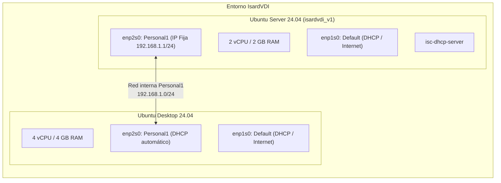

# Manual Paso a Paso: Pràctica 0 Servidor DHCP (Ubuntu Server)
**Institut TIC de Barcelona (ITICBCN) - Sistemes Operatius / Xarxes (UF1)**

---

## 📌 Contexto y Topología de la Práctica

Esta práctica se realiza íntegramente en la plataforma **IsardVDI** con dos máquinas virtuales interconectadas en una red interna aislada:



---

## 🧠 ¿Qué estamos haciendo y por qué? (Fundamentos Clave)

Antes de teclear comandos, es fundamental entender la lógica de red de este laboratorio:

1. **El Escenario de Red:**
   * **Red `Default` (`enp1s0`):** Conectada a la red de IsardVDI. Proporciona salida a Internet y acceso mediante el visor web (VNC) a ambas máquinas. **Esta red no se modifica**.
   * **Red `Personal1` (`enp2s0`):** Es un switch virtual privado y aislado que únicamente comunica a tu **Servidor** con tu **Cliente**. En este cable no existe ningún router ni servidor de DHCP externo.

2. **El Problema a Resolver:**
   * En cualquier red local, los equipos necesitan una dirección IP para comunicarse. Ponerlas a mano máquina por máquina (estática) es inviable a escala.
   * El protocolo **DHCP** (*Dynamic Host Configuration Protocol*) automatiza este reparto. El objetivo de la práctica es convertir tu máquina **Ubuntu Server** en el servidor DHCP que administre y reparta las direcciones IP dentro de la red `Personal1`.

3. **La Regla de Oro del Servidor DHCP:**
   * Para que un servidor pueda repartir direcciones IP a otros equipos, **su propia IP no puede ser dinámica ni cambiar**. Debe tener una dirección IP fija y conocida en esa red.
   * Por ese motivo, le asignamos a la tarjeta `enp2s0` del servidor la IP estática **`192.168.1.1/24`**.

4. **¿Por qué tocar dos archivos en Netplan?**
   * Las plantillas de Ubuntu en la nube vienen con el archivo `/etc/netplan/50-cloud-init.yaml`, que por defecto pide IP por DHCP en todas las tarjetas de red (`enp1s0` y `enp2s0`).
   * Para evitar colisiones y cumplir con la arquitectura limpia solicitada en la práctica (*un fichero por interfaz*):
     * En `50-cloud-init.yaml` dejamos únicamente `enp1s0` para mantener Internet.
     * En el nuevo `iface-enp2s0.yaml` desactivamos el DHCP (`dhcp4: no`) y fijamos la IP estática `192.168.1.1/24`.

5. **El Ciclo Final:**
   * Una vez fijada la IP del servidor y levantado el servicio `isc-dhcp-server`, iremos al **Ubuntu Desktop (Cliente)** para solicitar IP. Verás la negociación real **DORA** (*Discover, Offer, Request, Acknowledge*) donde el cliente recibe automáticamente su IP, máscara, puerta de enlace y servidores DNS desde tu servidor.

---

## 📋 Resumen de Parámetros Requeridos

La práctica se divide en **dos fases consecutivas** según el documento oficial:

### 🔹 Parte 1: Configuración Básica
* **Subred:** `192.168.1.0/24` (Máscara: `255.255.255.0`)
* **IP estática del Servidor:** `192.168.1.1` en la interfaz de `Personal1`
* **Fichero Netplan:** `/etc/netplan/iface-enp2s0.yaml` (un fichero independiente por interfaz)
* **Rango inicial DHCP:** Todo el rango de la subred (`192.168.1.1` al `192.168.1.254`)
* **Interfaz de servicio DHCP:** `/etc/default/isc-dhcp-server` -> `INTERFACESv4="enp2s0"`

### 🔹 Parte 2: Configuración Avanzada del Entorno (Opciones de Red y Reserva)
* **Exclusión de rango:** Excluir las 5 primeras direcciones de la subred (`.1` a `.5`) $\rightarrow$ rango dinámico: `192.168.1.6` al `192.168.1.254`
* **Puerta de enlace (*gateway* / *option routers*):** `192.168.1.1` (la IP del propio servidor que da salida a la red privada).  
  *(Nota: En la viñeta 1 el PDF menciona también 192.168.1.2 por una errata de redacción, pero 192.168.1.1 es la que coincide con la IP del servidor configurado).*
* **Tiempo de concesión (*lease time*):** 3 horas ($3 \times 3600 = 10800$ segundos)
* **Servidores DNS (*domain-name-servers*):** `8.8.8.8` y `1.1.1.1`
* **Reserva estática (*host*):** 
  * Nombre: `pc1`
  * MAC: `AA:BB:CC:DD:EE:FF`
  * IP fija asignada: `192.168.1.66`

---

## 🛠️ Fase 0: Verificación previa de Hardware y Redes en IsardVDI

Antes de encender las máquinas virtuales, accede al panel de IsardVDI y comprueba la configuración de ambas máquinas:

1. **Servidor (Ubuntu Server 24.04_isardvdi_v1):**
   * **vCPU:** 2
   * **Memoria:** 2 GB
   * **Xarxes (Tarjetas de red):** Deben estar añadidas **Default** y **Personal1**.
2. **Cliente (Ubuntu Desktop 24.04):**
   * **vCPU:** 4
   * **Memoria:** 4 GB
   * **Xarxes (Tarjetas de red):** Deben estar añadidas exactamente las mismas: **Default** y **Personal1**.

---

## 🚀 PARTE 1: Instalación y Configuración Básica

Inicia sesión en la máquina **Ubuntu Server** (usuario `isard` / contraseña predeterminada de Isard).

---

### 1. Actualització dels repositoris
Actualiza la lista de paquetes de los repositorios del sistema:
```bash
sudo apt update
```

---

### 2. Instal·lació del servidor DHCP
Instala el paquete oficial del servidor ISC-DHCP:
```bash
sudo apt install isc-dhcp-server -y
```

> 💡 *Nota técnica:* Es completamente normal que al finalizar la instalación aparezca un mensaje de aviso o error en rojo (`failed to start`). Esto ocurre porque el servicio intenta arrancar sin tener configurada ninguna interfaz de escucha ni ninguna subred válida. Se solucionará en los pasos siguientes.

---

### Identificación previa de interfaces de red
Antes de crear el archivo de Netplan, comprueba los nombres asignados a tus tarjetas de red:
```bash
ip -br a
```
Identificarás:
1. `lo`: Interfaz de loopback local.
2. `enp1s0` (o similar): Conectada a la red **Default** con una IP concedida por IsardVDI para acceso a Internet.
3. `enp2s0` (o similar): Conectada a la red **Personal1**, que actualmente estará sin dirección IP.

*(En este manual asumimos `enp2s0` tal como figura en el entorno de IsardVDI. Si en tu máquina se llama de otra manera, usa su nombre real).*

---

### 3. Asignar una IP estàtica al servidor (Netplan)
El enunciado exige explícitamente:
> *"has de tenir un fitxer de configuració de Netplan per a cada interfície de xarxa"*

Por defecto, la plantilla de IsardVDI incluye un archivo llamado `50-cloud-init.yaml` que tiene configuradas ambas tarjetas (`enp1s0` y `enp2s0`) con DHCP dinámico. Para cumplir la práctica y evitar conflictos, **debes tener un archivo para cada interfaz**:

#### Paso 3.1: Dejar en `50-cloud-init.yaml` únicamente `enp1s0`
1. Abre el archivo de cloud-init:
   ```bash
   sudo nano /etc/netplan/50-cloud-init.yaml
   ```
2. Borra o elimina las líneas de `enp2s0` para que quede **únicamente** la tarjeta de la red Default (`enp1s0`), tal como se ve en la captura izquierda del PDF:
   ```yaml
   network:
     version: 2
     ethernets:
       enp1s0:
         dhcp4: true
   ```
3. Guarda (`Ctrl + O`, `Enter`) y sal (`Ctrl + X`).

#### Paso 3.2: Crear el fichero independiente para `enp2s0`
1. Crea el **segundo fichero** de configuración de Netplan exclusivo para la interfaz de `Personal1` (`enp2s0`):
   ```bash
   sudo nano /etc/netplan/iface-enp2s0.yaml
   ```
2. Escribe el siguiente contenido (con 2 espacios de sangría por nivel, sin tabuladores), tal como figura en la captura derecha del PDF:
   ```yaml
   network:
     version: 2
     ethernets:
       enp2s0:
         dhcp4: no
         dhcp6: no
         addresses: [192.168.1.1/24]
   ```
3. Guarda pulsando `Ctrl + O`, presiona `Enter` y sal con `Ctrl + X`.

#### Paso 3.3: Aplicar los cambios en Netplan
Aplica la nueva configuración de red:
```bash
sudo netplan apply
```

---

### 4. Comprovar que la IP ha estat assignada a la targeta corresponent
Ejecuta los dos comandos de comprobación indicados en la práctica:
```bash
ip addr
sudo netplan status -a
```

O si deseas consultar específicamente la tarjeta:
```bash
ip addr show enp2s0
```
Verifica que `enp2s0` tiene asignada la IP fija `192.168.1.1/24`.

---

### 5. Fer una còpia i obrir el fitxer de configuració de DHCP
Siguiendo las buenas prácticas:

1. Realiza una copia de seguridad del archivo original de configuración de DHCP:
   ```bash
   sudo cp /etc/dhcp/dhcpd.conf /etc/dhcp/dhcpd.conf.bak
   ```

2. Abre el archivo con el editor nano:
   ```bash
   sudo nano /etc/dhcp/dhcpd.conf
   ```

---

### 6. Fer una còpia i obrir el fitxer per indicar la interfície
Para especificar por qué tarjeta debe escuchar el servicio DHCP:

1. Haz una copia de seguridad del archivo:
   ```bash
   sudo cp /etc/default/isc-dhcp-server /etc/default/isc-dhcp-server.bak
   ```

2. Ábrelo con nano:
   ```bash
   sudo nano /etc/default/isc-dhcp-server
   ```

3. Localiza la línea `INTERFACESv4=""` (al final del archivo) y especifica la interfaz conectada a `Personal1`:
   ```bash
   INTERFACESv4="enp2s0"
   ```

4. Guarda (`Ctrl + O`, `Enter`) y sal (`Ctrl + X`).

---

### 7. Fitxer de configuració del servidor amb les modificacions (Básica)
En la Parte 1, el requisito es:
> *"Servidor repartirà totes les adreces IP de la subxarxa 192.168.1.0/24"*

Abre de nuevo `/etc/dhcp/dhcpd.conf`:
```bash
sudo nano /etc/dhcp/dhcpd.conf
```

Añade al final del archivo la definición requerida:
```text
subnet 192.168.1.0 netmask 255.255.255.0 {
  range 192.168.1.1 192.168.1.254;
}
```

Guarda los cambios (`Ctrl + O`, `Enter`) y sal (`Ctrl + X`).

---

### 8. Reiniciar el servei DHCP
Reinicia el servicio para que tome la nueva configuración:
```bash
sudo systemctl restart isc-dhcp-server
```

---

### 9. Comproveu que el servei està actiu
Verifica el estado del servicio:
```bash
sudo systemctl status isc-dhcp-server
```
Debe figurar en color verde: **`Active: active (running)`**.

---

### 10. Veure al servidor les assignacions que s'han donat als clients (Guía Completa del Cliente)

En esta fase se produce el **objetivo central de la práctica**: conseguir que la máquina cliente (`Ubuntu Desktop`) se comunique con el servidor (`Ubuntu Server`) a través de la red privada `Personal1` y reciba su dirección IP automáticamente por DHCP.

Sigue estos pasos detallados:

#### 🖥️ A. Ir a la máquina Cliente (Ubuntu Desktop) en IsardVDI
1. En tu panel de IsardVDI, busca la tarjeta **Client Ubuntu SXI**.
2. Haz clic en el botón verde **Accedir amb visor: VNC al navegador**.
3. Se abrirá la sesión de escritorio de Ubuntu Desktop.
4. Abre una **Terminal** (atajo: `Ctrl + Alt + T` o pulsando el icono de la rejilla de aplicaciones abajo a la izquierda y escribiendo `terminal`).

#### 🔍 B. Identificar la tarjeta de la red `Personal1`
Ejecuta en el cliente:
```bash
ip -br a
```
Verás tres interfaces:
* `lo`: Loopback local (`127.0.0.1`).
* `enp1s0`: Conectada a la red **Default** (con la IP `10.2.x.x` que proporciona IsardVDI para Internet y el visor VNC).
* `enp2s0`: Conectada a la red **Personal1** (estará en estado `UP` o `DOWN`, pero **sin IP asignada**).

#### ⚡ C. Solicitar la IP al Servidor DHCP
Para forzar a la máquina cliente a pedir una IP a tu servidor en la red `Personal1`, ejecuta:

```bash
# 1. Asegurar que la interfaz está levantada
sudo ip link set dev enp2s0 up

# 2. Liberar cualquier concesión previa que pudiera existir
sudo dhclient -r enp2s0

# 3. Lanzar la petición DHCP en modo detallado (verbose)
sudo dhclient -v enp2s0
```

> 🎯 **¿Qué verás en la terminal al ejecutar este comando?**  
> Verás el intercambio de paquetes real del protocolo DHCP (**DORA**):
> ```text
> Listening on LPF/enp2s0/...
> Sending on   LPF/enp2s0/...
> DHCPDISCOVER on enp2s0 to 255.255.255.255 port 67 interval 3
> DHCPOFFER of 192.168.1.X from 192.168.1.1
> DHCPREQUEST for 192.168.1.X on enp2s0 to 255.255.255.255 port 67
> DHCPACK of 192.168.1.X from 192.168.1.1
> bound to 192.168.1.X -- renewal in ... seconds.
> ```
> * **DHCPDISCOVER:** El cliente busca un servidor en la red.
> * **DHCPOFFER:** Tu servidor `192.168.1.1` le ofrece una IP libre.
> * **DHCPREQUEST:** El cliente solicita formalmente esa IP.
> * **DHCPACK:** Tu servidor confirma la asignación.

*(Método alternativo: también puedes reiniciar el servicio de red ejecutando `sudo systemctl restart systemd-networkd` o `sudo systemctl restart NetworkManager`).*

#### 🧪 D. Comprobar la IP y la conectividad en el Cliente
Comprueba que la interfaz `enp2s0` ya tiene la IP asignada:
```bash
ip addr show enp2s0
```
*(Verás algo como `inet 192.168.1.X/24 brd 192.168.1.254 scope global enp2s0`).*

Prueba conectividad haciendo un ping directo a la IP de tu servidor:
```bash
ping -c 3 192.168.1.1
```
*(Debe responder con 0% packet loss).*

---

#### 📋 E. Comprobar la asignación en el Servidor (Ubuntu Server)
Regresa a la pestaña o ventana del **Ubuntu Server**:
1. Consulta el archivo de registro de concesiones (*leases*):
   ```bash
   cat /var/lib/dhcp/dhcpd.leases
   ```
2. Verás el bloque de concesión completo:
   ```text
   lease 192.168.1.X {
     starts 2 2026/09/29 ...;
     ends 2 2026/09/29 ...;
     hardware ethernet <MAC_DEL_CLIENTE>;
     client-hostname "ubuntu";
   }
   ```

---

## ⚙️ PARTE 2: Configuración Avanzada del Entorno

Una vez completada la configuración básica, el ejercicio plantea el siguiente entorno de ampliación:

> **2. Ahora vamos a configurar el siguiente entorno:**
> * Com a porta d'enllaç s'enviarà `192.168.1.1` (la IP del servidor).
> * El temps de concessió sigui de 3 hores.
> * Excepte les 5 primeres adreces de la subxarxa.
> * Servidors DNS farem servir `8.8.8.8` y `1.1.1.1`.
> * Reservarà la IP `192.168.1.66` per a un equip amb MAC `AA:BB:CC:DD:EE:FF` que en direm `pc1`.

---

### Paso 2.1: Modificar `/etc/dhcp/dhcpd.conf` con las directivas avanzadas
Edita el fichero de configuración en el Servidor:
```bash
sudo nano /etc/dhcp/dhcpd.conf
```

Sustituye o amplía el bloque de la subred con los nuevos parámetros:

```text
# Declarar autoridad en la red local
authoritative;

# Tiempos de concesión: 3 horas (3 * 3600 = 10800 segundos)
default-lease-time 10800;
max-lease-time 10800;

# Subred 192.168.1.0/24
subnet 192.168.1.0 netmask 255.255.255.0 {
    # Rango excluyendo las 5 primeras IPs (.1 a .5)
    range 192.168.1.6 192.168.1.254;

    # Máscara y Broadcast
    option subnet-mask 255.255.255.0;
    option broadcast-address 192.168.1.255;

    # Puerta de enlace (Gateway): IP del servidor
    option routers 192.168.1.1;

    # Servidores DNS requeridos
    option domain-name-servers 8.8.8.8, 1.1.1.1;
}

# Reserva estática para pc1
host pc1 {
    hardware ethernet AA:BB:CC:DD:EE:FF;
    fixed-address 192.168.1.66;
}
```

> 💡 *Nota:* Se establece `192.168.1.1` porque es la IP fija del propio Ubuntu Server configurada en el Paso 3. Si por alguna indicación en clase se requiriese `192.168.1.2` (mencionado en la primera viñeta), simplemente cambiarías esa línea.

Guarda con `Ctrl + O`, presiona `Enter` y sal con `Ctrl + X`.

---

### Paso 2.2: Validar sintaxis y reiniciar el servicio
Antes de reiniciar, comprueba que no haya errores de sintaxis en `dhcpd.conf`:
```bash
sudo dhcpd -t
```
Si devuelve una salida limpia sin errores de parseo, reinicia el servicio:
```bash
sudo systemctl restart isc-dhcp-server
sudo systemctl status isc-dhcp-server
```

---

### Paso 2.3: Verificación final en el Cliente (Ubuntu Desktop)

1. **Liberar y solicitar nueva IP:**
   ```bash
   sudo dhclient -r enp2s0
   sudo dhclient -v enp2s0
   ```

2. **Comprobar la IP y rango:**
   ```bash
   ip a show enp2s0
   ```
   *Debe recibir una IP $\ge 192.168.1.6$, respetando la exclusión de las 5 primeras IPs.*

3. **Comprobar Gateway y DNS:**
   ```bash
   ip route show
   cat /etc/resolv.conf
   ```
   *(Verás la puerta de enlace `default via 192.168.1.1`, y los DNS `8.8.8.8`, `1.1.1.1`).*

4. **Verificar la Reserva MAC (Simulación opcional de `pc1`):**
   Si deseas verificar que la reserva de `pc1` funciona, puedes cambiar temporalmente la dirección MAC de la interfaz del cliente:
   ```bash
   sudo ip link set dev enp2s0 down
   sudo ip link set dev enp2s0 address aa:bb:cc:dd:ee:ff
   sudo ip link set dev enp2s0 up
   sudo dhclient -v enp2s0
   ip addr show enp2s0
   ```
   *Comprobarás que el servidor le asigna exactamente la IP reservada `192.168.1.66`.*

---

## 🔍 Checklist de Troubleshooting ("Si et falla recorda comprovar")

Tal como advierte la última página del PDF oficial:

- [ ] **Dos ficheros de configuración de Netplan (.yaml):**
  - Uno para `Default` (por ejemplo `/etc/netplan/50-cloud-init.yaml` con DHCP activo en `enp1s0`).
  - Otro independiente para `Personal1` (`/etc/netplan/iface-enp2s0.yaml` con IP estática `192.168.1.1/24`).
- [ ] **Fichero `/etc/default/isc-dhcp-server` correctamente configurado:**
  - Asegurar que la línea `INTERFACESv4="enp2s0"` apunta a la tarjeta de `Personal1` y no a `eth0` o vacía.
- [ ] **Sintaxis de `dhcpd.conf`:**
  - Todas las líneas de directivas terminan en punto y coma (`;`).
  - Las llaves `{` y `}` de las directivas `subnet` y `host` están correctamente cerradas.
- [ ] **Comprobación de logs en caso de fallo:**
  - Si el servicio no arranca, ejecuta:
    ```bash
    sudo journalctl -xeu isc-dhcp-server.service
    ```

---

## 📑 Tabla Resumen de Comandos y Comprobaciones Clave

| Paso | Descripción de la Tarea | Comando / Fichero clave | Comprobación esperada |
| :---: | :--- | :--- | :--- |
| **1** | Actualització dels repositoris | `sudo apt update` | Repositorios sincronizados correctamente. |
| **2** | Instal·lació del servidor DHCP | `sudo apt install isc-dhcp-server` | Paquete instalado en el servidor. |
| **3** | Asignar IP estàtica al servidor (Netplan) | `/etc/netplan/iface-enp2s0.yaml` | Fichero independiente con IP `192.168.1.1/24` en `enp2s0`. |
| **4** | Comprovar que la IP ha estat assignada | `ip addr` / `sudo netplan status -a` | Tarjeta `enp2s0` con la IP `192.168.1.1/24` activa. |
| **5** | Fer còpia i obrir `/etc/dhcp/dhcpd.conf` | `cp dhcpd.conf dhcpd.conf.bak` + `nano` | Copia de seguridad creada y archivo listo para editar. |
| **6** | Indicar interfície a `/etc/default/isc-dhcp-server` | `nano /etc/default/isc-dhcp-server` | Línea editada con `INTERFACESv4="enp2s0"`. |
| **7** | Fitxer de configuració del servidor (Part 1) | `/etc/dhcp/dhcpd.conf` | Bloque `subnet 192.168.1.0` con `range 192.168.1.1 192.168.1.254;`. |
| **8** | Reiniciar el servei DHCP | `sudo systemctl restart isc-dhcp-server` | Servicio reiniciado sin avisos de error. |
| **9** | Comprovar que el servei està actiu | `sudo systemctl status isc-dhcp-server` | Estado en verde `active (running)`. |
| **10** | Asignación DHCP en el cliente | `dhclient -v enp2s0` / `cat dhcpd.leases` | Cliente recibe IP del rango y servidor registra el lease. |
| **Avanzado** | Entorno avanzado (Opciones y Reserva) | `/etc/dhcp/dhcpd.conf` | Exclusión 5 IPs, router `192.168.1.1`, DNS, lease 3h y reserva `pc1`. |
