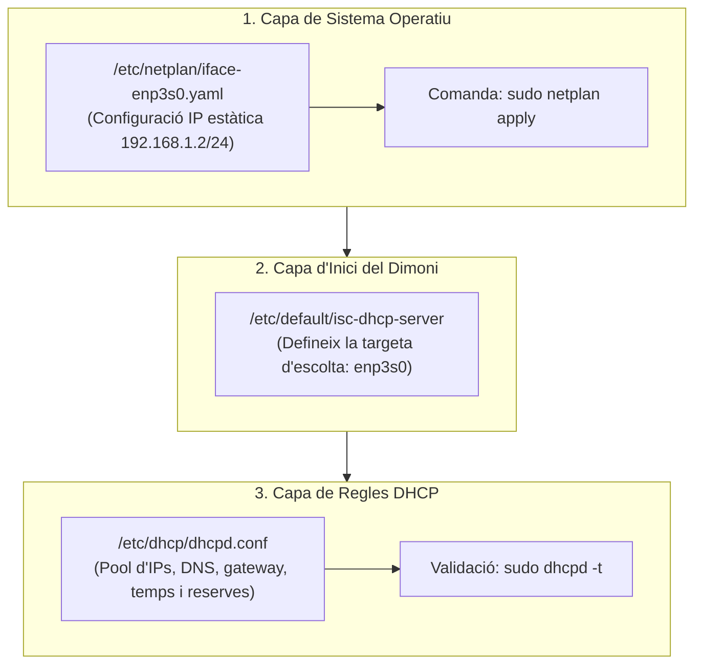
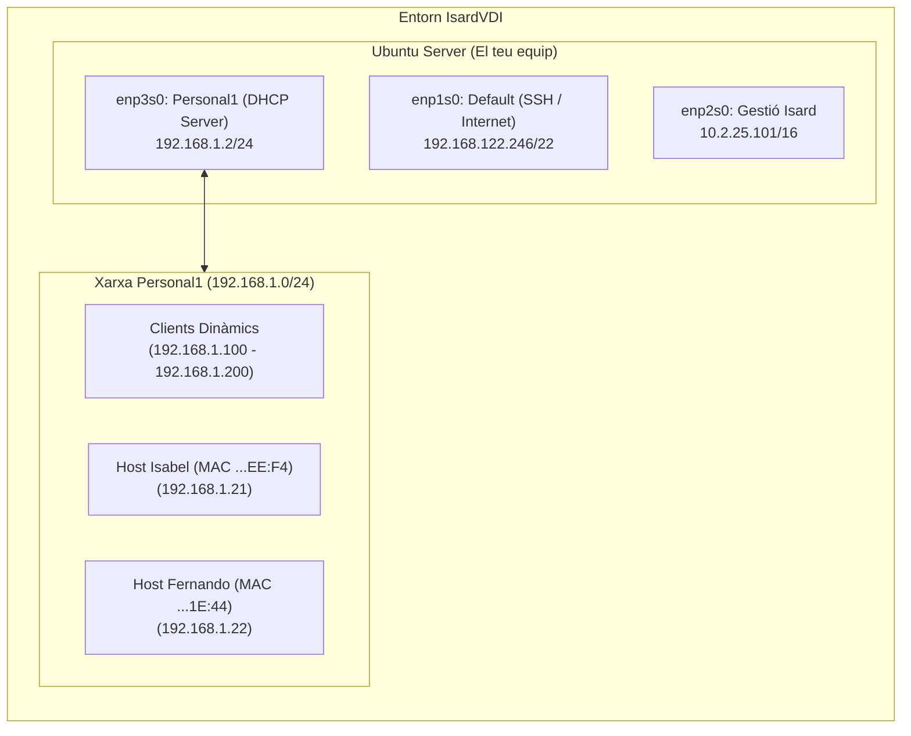

# Manual de Pràctica 1: Serveis DHCP (isc-dhcp-server)
**M06 / Sistemes Operatius en Xarxa — Institut TIC de Barcelona**

---

## 1. Teoria Resumida: Com funciona DHCP

El protocol **DHCP** (*Dynamic Host Configuration Protocol*, UDP 67/68) s'encarrega d'assignar automàticament la configuració de xarxa (IP, màscara, gateway, DNS i temps de concessió) als equips que es connecten.

### El Cicle DORA (Procés d'assignació d'IP)
Quan un equip s'encén configurat per DHCP, segueix quatre fases:
1. **Discover (DHCPDISCOVER):** El client envia un paquet de difusió (*broadcast*, origen `0.0.0.0` a destí `255.255.255.255`) sol·licitant paràmetres de xarxa i adjuntant la seva adreça física MAC.
2. **Offer (DHCPOFFER):** El servidor respon oferint una adreça IP disponible del pool, juntament amb la màscara, la porta d'enllaç i els servidors DNS.
3. **Request (DHCPREQUEST):** El client confirma i sol·licita formalment l'adreça IP proposada pel servidor.
4. **Acknowledge (DHCPACK):** El servidor valida la concessió, l'emmagatzema al registre actiu (`/var/lib/dhcp/dhcpd.leases`) i autoritza el client a utilitzar la IP.

### Fitxers de Configuració: Què són, per a què serveixen i com s'editen

Aquesta pràctica es basa en modificar i entendre **tres fitxers clau** al sistema:



#### 1. `/etc/netplan/iface-enp3s0.yaml` (Xarxa d'Ubuntu / Netplan)
* **Què és:** És el fitxer que utilitza **Netplan** (el gestor de xarxa centralitzat d'Ubuntu des de 18.04) per aplicar la IP estàtica a la interfície del servidor. Netplan agafa aquest fitxer i el tradueix al motor de xarxa del sistema (`systemd-networkd`).
* **Com s'edita:** Mitjançant l'editor de terminal:
  ```bash
  sudo nano /etc/netplan/iface-enp3s0.yaml
  ```
* **Regles estrictes de sintaxi (format YAML):**
  * **Prohibit usar tabuladors (`Tab`):** YAML no admet tabuladors; provocaran un error d'execució.
  * **Indentació de 2 espais:** Cada nivell jeràrquic ha d'estar desplaçat exactament dos espais respecte a l'anterior.
  * **Estructura clau-valor:** Totes les opcions s'escriuen com `clau: valor` (sempre amb un espai després dels dos punts).
* **Com s'aplica:** Amb `sudo netplan apply` (o de forma segura amb `sudo netplan try`).

---

#### 2. `/etc/default/isc-dhcp-server` (Interfícies del servei)
* **Què és:** Fitxer de variables d'entorn del paquet Debian/Ubuntu per al servei `isc-dhcp-server`. Serveix per indicar al sistema operatiu **per quines targetes de xarxa físiques ha d'escoltar i respondre** el dimoni DHCP.
* **Com s'edita:**
  ```bash
  sudo nano /etc/default/isc-dhcp-server
  ```
* **Com es configura:** Modificant la variable `INTERFACESv4="enp3s0"`. Si es deixa buida, el servei intentarà associar-se a totes les interfícies o fallarà si alguna no té una subxarxa vàlida configurada.

---

#### 3. `/etc/dhcp/dhcpd.conf` (Configuració central de regles DHCP)
* **Què és:** És el **cervell del servidor DHCP**. Aquí es defineix tota la lògica del servei: els paràmetres globals, els rangs d'adreces IP dinàmiques per a la subxarxa, les opcions que s'envien als clients (DNS, màscara, gateway), i les reserves estàtiques per adreça física (MAC).
* **Com s'edita:**
  ```bash
  sudo nano /etc/dhcp/dhcpd.conf
  ```
* **Regles estrictes de sintaxi:**
  * **Blocs amb claus `{ }`:** La subxarxa (`subnet`) i cada reserva (`host`) s'obren i es tanquen amb claus.
  * **Punt i coma obligatori (`;`):** Cada línia d'opció o paràmetre ha d'acabar estrictament amb un punt i coma. Si te'n deixes un, el servei no arrencarà.
  * **Directives en anglès:** Sintaxi com `hardware ethernet` (no traduït com a maquinari), `range`, `fixed-address`, etc.
  * **Espais obligatoris:** Valors separats sempre per espais (ex: `range 192.168.1.100 192.168.1.200;`).
* **Jerarquia de prioritat d'àmbits:**
  1. **Host (Reserva):** Màxima prioritat. Sobreescriu qualsevol altra directiva per a aquell equip concret.
  2. **Subnet:** S'aplica als equips del rang d'aquella subxarxa.
  3. **Global:** Paràmetres que s'apliquen si no s'han definit a nivell de subxarxa o host.
* **Com es comprova abans d'arrencar:** Amb la comanda de test:
  ```bash
  sudo dhcpd -t
  ```

---

#### 4. Fitxer de registre: `/var/lib/dhcp/dhcpd.leases` (Base de dades activa)
* **Què és:** És el fitxer on el servidor DHCP emmagatzema l'estat en temps real de totes les concessions atorgades als clients (IP assignada, MAC, hora d'inici i hora de fi del lease).
* **Important:** **MAI s'ha d'editar manualment**, el gestiona el dimoni de forma automàtica. Es consulta amb:
  ```bash
  cat /var/lib/dhcp/dhcpd.leases
  ```

---

## 2. Què farem i Com ho farem

### Objectiu
Muntar i configurar un servidor DHCP complet a Linux (Ubuntu Server) utilitzant el paquet clàssic de referència en sistemes `isc-dhcp-server`. Un cop actiu, configurarem tant un rang dinàmic per a clients genèrics com reserves estàtiques amb paràmetres personalitzats per a equips concrets, verificant les concessions i els logs.

### Mapa d'Interfícies del teu Servidor a IsardVDI
A la teva màquina virtual tens detectades 4 interfícies de xarxa:
* **`enp1s0` (`192.168.122.246/22`):** Xarxa `Default` d'IsardVDI (Connexió SSH i accés a Internet). **CRÍTIC: NO TOCAR MAI**, si es modifica es perd la sessió SSH.
* **`enp2s0` (`10.2.25.101/16`):** Xarxa interna de gestió d'IsardVDI.
* **`enp3s0` (`192.168.1.2/24`):** Targeta connectada a la xarxa aïllada **`Personal1`**. És la interfície per on el servidor escoltarà i oferirà el servei DHCP als clients.
* **`enp4s0`:** Interfície apagada (*DOWN*).



---

## 3. Pas a Pas per Completar la Pràctica

### Pas 1: Comprovar o Aplicar la IP estàtica a `enp3s0` (Netplan)
La interfície `enp3s0` ha de tenir la IP `192.168.1.2/24`.

1. Revisa si ja tens el fitxer creat:
   ```bash
   cat /etc/netplan/iface-enp3s0.yaml
   ```
2. Si no existeix o està buit, crea'l amb:
   ```bash
   sudo nano /etc/netplan/iface-enp3s0.yaml
   ```
   I assegura't que contingui exactament:
   ```yaml
   network:
     version: 2
     renderer: networkd
     ethernets:
       enp3s0:
         dhcp4: no
         addresses:
           - 192.168.1.2/24
   ```
3. Aplica i verifica que la IP està assignada:
   ```bash
   sudo netplan apply
   ip -br a show enp3s0
   ```
   *(Hauràs de veure `enp3s0 UP 192.168.1.2/24`).*

---

### Pas 2: Instal·lació de `isc-dhcp-server`
Instal·lem el paquet oficial del servei:
```bash
sudo apt update
sudo apt install isc-dhcp-server -y
```
*(És normal que doni un missatge d'avís en vermell en acabar la instal·lació; el servei encara no està configurat).*

---

### Pas 3: Indicar la interfície d'escolta (`enp3s0`)
Indiquem que el servei ha de treballar exclusivament sobre `enp3s0`:
```bash
sudo nano /etc/default/isc-dhcp-server
```
Vés al final del fitxer i deixa la variable així:
```bash
INTERFACESv4="enp3s0"
INTERFACESv6=""
```
*(Guarda amb `Ctrl+O`, `Enter` i surt amb `Ctrl+X`).*

---

### Pas 4: Còpia de seguretat del fitxer de configuració
Abans de tocar res, fem un backup net del fitxer original d'exemple:
```bash
sudo cp /etc/dhcp/dhcpd.conf /etc/dhcp/dhcpd.conf.original
```

---

### Pas 5: Configuració de `/etc/dhcp/dhcpd.conf`
Obrim el fitxer de configuració per editar-lo:
```bash
sudo nano /etc/dhcp/dhcpd.conf
```

Substitueix tot el contingut (o afegeix al final) el següent bloc net i corregit:

```text
# ==========================================
# PARÀMETRES GLOBALS
# ==========================================
authoritative;
one-lease-per-client on;
default-lease-time 600;
max-lease-time 7200;
option domain-name "aula53.asir";
option domain-name-servers 192.168.1.10, 192.168.1.11;

# Opcions de seguretat
ddns-update-style none;
deny declines;
deny bootp;

# ==========================================
# DEFINICIÓ DE LA SUBXARXA I RANG DINÀMIC
# ==========================================
subnet 192.168.1.0 netmask 255.255.255.0 {
    range 192.168.1.100 192.168.1.200;
    option broadcast-address 192.168.1.255;
    option routers 192.168.1.1;
    option subnet-mask 255.255.255.0;
}

# ==========================================
# RESERVES PER ADREÇA FÍSICA (MAC)
# ==========================================
host Isabel {
    hardware ethernet 00:00:45:12:EE:F4;
    fixed-address 192.168.1.21;
    default-lease-time -1;
    max-lease-time -1;
    option host-name "Isabel";
}

host Fernando {
    hardware ethernet 00:00:45:13:1E:44;
    fixed-address 192.168.1.22;
    option domain-name-servers 192.168.1.20;
}
```

> [!IMPORTANT]
> **Correccions crítiques respecte al PDF del professor:**
> 1. Al PDF posa `maquinari ethernet`; a ISC DHCP la directiva sintàctica obligatòria és en anglès: **`hardware ethernet`**. Si poses maquinari, donarà fallada de sintaxi.
> 2. Al PDF posa `deni declines;`; cal posar **`deny declines;`** (amb `y`).
> 3. Al PDF els rangs i opcions apareixen sense espais (`range 192.168.1.100192.168.1.200;`, `option routers192.168.1.1;`). Cal separar sempre els arguments amb un espai (`192.168.1.100 192.168.1.200;`).

---

### Pas 6: Verificació de sintaxi i engegada del servei
1. Comprova si hi ha errors de sintaxi abans de reiniciar:
   ```bash
   sudo dhcpd -t
   ```
   *(Si no retorna cap error i acaba amb codi net, la configuració és correcta).*
2. Reinicia i comprova que el servei està actiu:
   ```bash
   sudo systemctl restart isc-dhcp-server
   sudo systemctl status isc-dhcp-server
   ```
   Ha de mostrar `active (running)` en color verd.

---

### Pas 7: Monitorització, Logs i Concessions
* Per veure les peticions dels clients en temps real (ideal quan engegues el client per veure el DORA):
  ```bash
  sudo journalctl -u isc-dhcp-server -f
  ```
* Per veure les concessions atorgades i el seu temps de vida:
  ```bash
  cat /var/lib/dhcp/dhcpd.leases
  ```

---

### Pas 8: Comprovació des dels Clients
1. A la màquina client (Ubuntu Desktop / Windows) connectada a la xarxa `Personal1`:
   * **Linux:** Demanar IP per DHCP a la interfície:
     ```bash
     sudo dhclient -r enp2s0    # Allibera la IP actual
     sudo dhclient -v enp2s0    # Demana nova IP veient el procés
     ip a show enp2s0           # Comprova que ha agafat IP del rang 192.168.1.100-200
     ip route show              # Comprova el gateway 192.168.1.1
     resolvectl status enp2s0   # Comprova els DNS 192.168.1.10 i 192.168.1.11
     ```
   * **Windows:**
     ```cmd
     ipconfig /release
     ipconfig /renew
     ipconfig /all
     ```

---

## 4. Preguntes de la Pràctica

### 📌 Preguntes Principals (sobre el fitxer de configuració)

#### 1. Quin ús té l'option host-name?
Assigna directament el nom de màquina (*hostname*) al sistema operatiu del client.

#### 2. Quina porta d'enllaç s'assignarà al host 192.168.1.101? I quins servidors DNS?
* **Porta d'enllaç:** `192.168.1.1` (definida a la directiva `option routers` de la subxarxa).
* **Servidors DNS:** `192.168.1.10` i `192.168.1.11` (heretats de la configuració global).

#### 3. Si un host amb MAC 00:11:33:44:AA:FF sol·licita una IP amb temps de concessió de 4 hores. Què passarà? Quin nom de domini tindrà aquest equip? Quin servidor DNS utilitzarà?
* **Temps:** Rebrà només **2 hores (7.200 s)**, ja que el servidor limita la concessió màxima amb `max-lease-time 7200`.
* **Nom de domini:** `aula53.asir` (global).
* **Servidors DNS:** `192.168.1.10` i `192.168.1.11` (globals).

#### 4. Si un host qualsevol que no és ni “Isabel” ni “Fernando” demana una concessió per quant de temps se li donarà?
Rebrà el temps per defecte: **600 segons (10 minuts)** (`default-lease-time`), o el temps sol·licitat pel client sempre que no superi els 7.200 s (`max-lease-time`).

#### 5. Quin temps de concessió es donarà al host Isabel?
Temps **il·limitat / permanent** (`-1` deshabilita la caducitat de la concessió).

#### 6. Quin servidor DNS utilitzarà “Fernando”?
Únicament el **`192.168.1.20`**, ja que la directiva del seu bloc `host` preval sobre els DNS globals.

#### 7. Quin servidor DNS utilitzarà “Isabel”?
Els DNS globals **`192.168.1.10` i `192.168.1.11`**, en no tenir servidors DNS específics al seu bloc de reserva.

#### 8. Què passarà si “Fernando” demana una IP durant 5 hores?
Se li concedirà un màxim de **2 hores (7.200 s)**, limitat pel paràmetre global `max-lease-time`.

#### 9. En cas que la màquina on tenim instal·lat el servidor DHCP tingui diverses targetes de xarxa. Com diem al servidor que ha d'assignar adreces només per una?
Definint la interfície concreta a la directiva `INTERFACESv4` del fitxer `/etc/default/isc-dhcp-server` (ex: `INTERFACESv4="enp3s0"`).

#### 10. Què vol dir el paràmetre Authoritative en un servidor DHCP?
Indica que el servidor és l'autoritat oficial de la xarxa. Si un client sol·licita una IP incorrecta o fora de subxarxa, el servidor envia un paquet `DHCPNAK` forçant el client a descartar-la i sol·licitar-ne una de nova.

---

### 💡 Més Preguntes Opcionals

#### ● Quan un client configurat amb DHCP s'encén, no té cap IP. En aquests moments en què el client encara no té ip assignada, com es reconeixen el servidor i el client?
Mitjançant **difusió (*broadcast*)** a nivell 2 i 3 (IP origen `0.0.0.0`, destí `255.255.255.255`), identificant el client a través de la seva adreça física **MAC**.

#### ● Quins ports i quins protocols utilitza el servei DHCP? Com puc veure quins ports utilitza el servidor dhcp?
* **Protocol i ports:** UDP port **67** (servidor) i UDP port **68** (client).
* **Comanda:** `sudo ss -unlp | grep dhcpd`

#### ● Què és el lease time?
El període de vigència durant el qual un client té autorització per utilitzar una IP abans d'haver de renovar-la.

#### ● Defineix els paràmetres: “Max-lease-time”, “one-lease-per-client” i “option host-name”:
* **`max-lease-time`:** Temps límit màxim de concessió permès pel servidor.
* **`one-lease-per-client on;`:** Allibera la concessió prèvia d'un client si aquest en sol·licita una de nova abans que expiri l'anterior.
* **`option host-name`:** Especifica el nom de xarxa que el client ha d'adoptar.

#### ● Què faries per esbrinar la MAC del teu equip de classe?
* **Linux:** `ip link` o `ip addr` (camp `link/ether`).
* **Windows:** `ipconfig /all` (*Dirección física*) o `Get-NetAdapter` a PowerShell.

#### ● Amb quin missatge un client indica al servidor que vol alliberar la seva adreça IP?
Mitjançant el missatge **`DHCPRELEASE`**.

#### ● En quins casos seria més convenient triar una configuració dhcp per assignació dinàmica abans que per assignació automàtica?
En entorns amb **alta rotació d'equips** (aules, xarxes Wi-Fi, portàtils), ja que l'assignació dinàmica recicla les adreces en expirar el lease; l'automàtica les reté indefinidament, provocant l'esgotament del pool.
